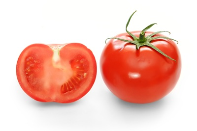
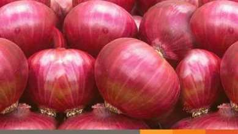

<a style="padding: 5px;" href="the-box-model.html" target="blank">The Box Model  </a>
<a style="padding: 5px;" href="layout.html" target="blank">Layout  </a>
<a style="padding: 5px;" href="The Terminal.html" target="blank">The Terminal  </a>
<a style="padding: 5px;" href="My Web Site/index.html" target="blank">Nav Bar  </a>
<a style="padding: 5px;" href="My Web Site/animated.html" target="blank">Nav Bar Animated </a>
<a style="padding: 5px;" href="Expanding Search Box On Click Using Html CSS And JQuery/index - Copy.html" target="blank">Expanding Search Box </a>
<a style="padding: 5px;" href="Animated Search Box effect using HTML and CSS/Animated Search Box effect using HTML and CSS.html" target="blank">Animated Search Box effect using HTML and CSS </a>

<link rel="stylesheet" href='css/bootstrap.css'>

<h1>ROBIN Online Delivery</h1>

<h2>Welcome</h2>
Enter your name hare
<input>
Password
<input type="password">
<button>Login</button>
<button class='btn btn-success'>Sign up</button>
<button type="button" class="btn btn-outline-info"><a href='https://www.facebook.com'>f</a></button>

<h3>Rice</h3>

  
  
Price: 50 Taka

  
Available now

<h3>Soyabin Oil</h3>

  
  
Price: 500 Taka

  
Available now

  <h3>Tomato</h3>
  
  
Price: 60 Taka

  
Not available now

  <h3>Soap</h3>
  
  
Price: 40 Taka

  
Available now

  <h3>Soap</h3>
  
  
Price: 40 Taka

  
Available now

Comments
<input>
